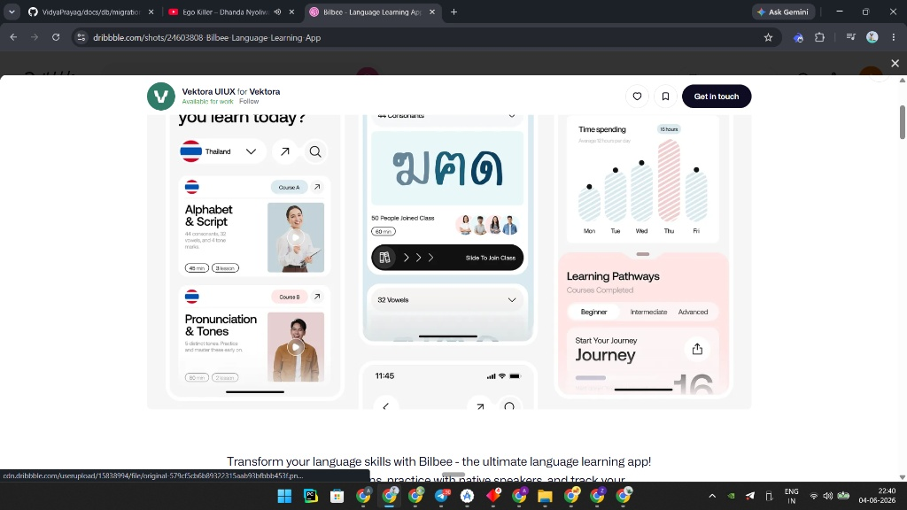
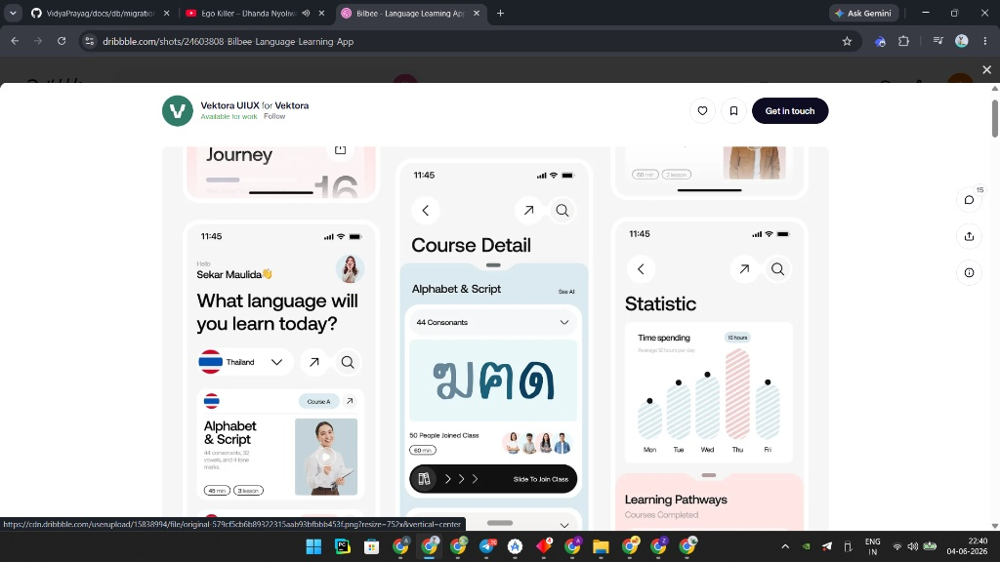

# VidyaPrayag — School Side Deep Audit & Master Plan

> **Audit type:** Deepest-possible school-side code + DB + infra audit.
> **Mandate:** FIND every issue and write the most detailed possible plan. **No fixes applied yet** — this is the investigation + planning artifact. Fixing begins in a later pass.
> **Branch:** `backend-by-abuzar`  ·  **Base commit at audit:** `65a4aae` (merge of #22)
> **Stack:** Kotlin Multiplatform / Compose Multiplatform (`composeApp`) · Ktor + Exposed + HikariCP (`server`) · shared ViewModels/repos (`shared`) · Supabase Postgres (session pooler :5432) · Supabase Storage · Render free tier.
> **Design north star:** *Bilbee — Language Learning App* (Dribbble, Vektora UIUX). See **§10**.

---

## 0. TL;DR — The 6 Reported Issues, Verdict & Root Cause

| # | Reported by user | Verdict after code audit | Where it actually lives | Effort |
|---|------------------|--------------------------|--------------------------|--------|
| 1 | Email signup → no OTP verification; no forgot-password | **CONFIRMED.** OTP engine is fully built but email signup *bypasses* it; forgot/reset endpoints **do not exist anywhere**. | `AuthRouting.kt` (server), `AuthViewModel.kt` + `AuthBottomSheet.kt` (client) | High |
| 2 | Login as admin shows normal/guest screens; no "Hello [name]" | **CONFIRMED — root cause found.** Role-string vocabulary mismatch: UI uses `"ADMIN"/"PARENT"`, backend persists `"school_admin"/"parent"`. On restart neither matches → Landing/Guest. | `App.kt` L97-102, `VidyaPrayagDrawer.kt` L66/L128, `AuthRepositoryImpl.saveSession` | Low (high impact) |
| 3 | Cannot add classes/subjects/teachers; need subject pool + teacher assignment | **CONFIRMED.** Backend **already has** class/subject/teacher-assignment tables + CRUD endpoints; **UI + ViewModel are read-only/hardcoded**; **faculty (teacher profile) CRUD endpoint missing**; **Supabase prod schema file is incomplete** for these tables. | `AcademicInfoOBScreen.kt`, `AcademicInfoOBViewModel.kt`, missing `FacultyRouting.kt`, `supabase_schema` | High |
| 4 | Cannot upload photos in forms | **PARTIALLY CONFIRMED.** Real picker + multipart + Supabase Storage **all implemented and wired in only 2 screens** (Branding, Institutional Profile). Every other form (announcements, admissions, results, launch docs) has **no upload wiring**. Storage env IS set on Render. | `MediaPicker`, `MediaApi`, `SupabaseStorage`, `MediaRouting` (all good); missing wiring elsewhere | Medium |
| 5 | Location takes forever even with GPS on | **CONFIRMED.** Up to **12s** hard timeout on live fix; no "searching…" UI feedback; single-shot listener with `0L/0f` min-interval; no fused/Play-Services fast path. | `LocationProvider.android.kt` L130 | Medium |
| 6 | Full premium UI revamp to Bilbee look; logo; launch animation | **PLAN DEFINED (this doc, §10–§13).** Current palette is navy+emerald (AI-ish), splash uses a generic `Icons.Default.School`, charts/icons are stock. | Theme `Color.kt`, `SplashScreen.kt`, all admin screens | Very High |

**Secondary bugs found during the audit (not in the user's list but real):**
- **B1.** Refresh token is **never persisted** — only held in in-memory `cachedSession`. App restart ⇒ cannot auto-refresh ⇒ silent logout. (`PreferenceRepository` has no refresh slot.)
- **B2.** `OTP_DEV_RETURN_CODE` **defaults to `true`** in code (`OtpService.kt` L126) — a security risk if Render env is ever unset.
- **B3.** `supabase_schema` file is the **old "VidyaSetu" v2.1** schema, models `auth.users` (Supabase Auth) while the backend is decoupled onto `app_users`; it is **missing** ~18 operational tables the backend actually uses.
- **B4.** `AcademicInfoState` ships **hardcoded** default classes/subjects ("Class 8", "Dr. Arpita Sharma") that leak into a brand-new tenant's UI.

---

## 1. QUICK STATUS — Working vs Broken (as of this audit)

### ✅ Working (verified in code)
- Phone signup with real OTP gate (`AuthRouting` send-otp → verify-otp → signup).
- OTP engine: 6-digit, SHA-256+salt+pepper, 10-min TTL, brute-force lock (5), resend rate-limit (5/hr), multi-provider delivery chain + full audit table.
- JWT access token issue + login (email→password, phone→OTP).
- School onboarding submit pipeline (BASIC/BRANDING/ACADEMIC/REVIEW) persisting to **real** `schools`, `school_classes`, `school_subjects`.
- Media upload backend (multipart → Supabase Storage → public URL → `school_media` row, 25 MB cap, type allow-list, clean 503 when unconfigured).
- Teacher↔subject assignment backend CRUD (`/api/v1/school/teacher-assignments` GET/POST/DELETE, upsert-safe).
- School dashboard greeting card *renders* "Welcome, $adminName" — **when** `/user/details` resolves.
- Premium button system (gradient body, gloss, spring press, loading spinner) already exists.
- Staged splash animation exists (just uses a stock icon, no real logo).

### ❌ Broken / Missing (verified in code)
- **Email signup has no OTP step** (server requires only password).
- **No forgot-password / reset-password** endpoints, ViewModel steps, or UI links.
- **Role mismatch** → admin appears logged-out / "Guest User" with no school features after restart.
- **Refresh token not persisted** → cannot survive restart.
- **Academic step is read-only** → cannot add class/subject/teacher; no subject pool; no teacher profiles.
- **Faculty (teacher profile) CRUD endpoint missing** on server.
- **Photo upload wired in only 2 of ~6 forms.**
- **Location up to 12s** with no progress UI.
- **Production Supabase schema file incomplete** (missing operational tables).
- **UI is not investor-grade** (palette, icons, charts, imagery, density all need rework).

---

## 2. Modules & Files Reviewed in This Pass

```
composeApp/  (UI)
  App.kt ............................. start-destination routing (Issue #2 root cause)
  ui/auth/AuthBottomSheet.kt ......... role set on success; signup details; no forgot link
  ui/components/VidyaPrayagDrawer.kt . role gating (Issue #2 confirm)
  ui/components/PremiumButton.kt ..... button system baseline (UI §10)
  ui/screens/SplashScreen.kt ......... launch animation baseline (uses stock icon)
  ui/screens/admin/SchoolDashboardScreen.kt . greeting card
  ui/screens/admin/AcademicInfoOBScreen.kt ... read-only academic UI (Issue #3)
  ui/screens/admin/BrandingInfoOBScreen.kt ... media picker WIRED
  ui/screens/admin/InstitutionalProfileScreen.kt media picker WIRED
  ui/theme/Color.kt .................. navy+emerald palette (UI §10)
  androidMain/ui/location/LocationProvider.android.kt . GPS (Issue #5)
  androidMain/ui/media/MediaPicker.android.kt ......... real picker (Issue #4)

shared/  (logic)
  feature/auth/.../AuthViewModel.kt, AuthModels.kt, AuthRepositoryImpl.kt, AuthApi.kt
  feature/admin/.../AcademicInfoOBViewModel.kt (hardcoded defaults; no add/assign)
  feature/admin/.../MediaApi.kt (real upload client)
  feature/admin/.../SchoolDashboardViewModel.kt (adminName default "Admin")
  presentation/MainViewModel.kt (role StateFlow from prefs)
  core/prefs/PreferenceRepository.kt (NO refresh-token slot — bug B1)

server/  (Ktor)
  feature/auth/AuthRouting.kt (no forgot-password; email-signup no OTP)
  feature/auth/OtpService.kt (full engine; DEV_RETURN_CODE default true — B2)
  feature/school/TeacherAssignmentRouting.kt (full CRUD — works)
  feature/media/MediaRouting.kt, SupabaseStorage.kt (full — works)
  feature/onboarding/OnboardingRouting.kt (persists classes/subjects)
  db/Tables.kt (Exposed — has app_users, classes, subjects, assignments, faculty)
  db/DatabaseFactory.kt (AUTO_CREATE_TABLES → SchemaUtils.createMissingTablesAndColumns)

root/
  supabase_schema (OLD VidyaSetu v2.1 — incomplete — B3)
  docs/backend/sql/01_supplementary_schema.sql (the REAL backend tables)
  docs/db/vidyasetu_schema.sql (legacy)
```

---

## 3. ISSUE #1 — Authentication: No Email OTP + No Forgot Password

### 3.1 Email signup bypasses OTP entirely
**Evidence — `server/.../auth/AuthRouting.kt` (signup handler):**
```kotlin
if (isEmail(id)) {
    if (req.password.isNullOrBlank()) {
        call.fail("password is required for email signup", ...); return@post
    }
    // ❌ NO check for a verified auth_otps row for this email.
}
```
Phone signup *does* require a verified OTP row; email signup creates the account on password alone.

**Root cause:** Email branch was implemented as "password-only" MVP; the OTP engine (which already supports `identifierType = "email"` and an SMTP provider) was never inserted into the email signup path.

**What "correct" looks like:**
1. `POST /auth/send-otp { identifier: email, purpose: "signup" }` → SMTP/console delivers code.
2. New step in client between *SignupDetails* and account creation: **Email OTP**.
3. `POST /auth/signup` must verify `auth_otps(email, "signup").is_verified = true` (and recent) before inserting `app_users`, then set `is_email_verified = true`.

### 3.2 Forgot password does not exist
**Evidence:** `AuthRouting.kt` exposes only `check-user, send-otp, verify-otp, signup, login, refresh`. No `forgot-password`, no `reset-password`. `AuthViewModel.AuthStep` has only `Identifier, LoginPassword, SignupDetails, Otp` — no forgot/reset states. `AuthBottomSheet.kt` has no "Forgot password?" link.

**What "correct" looks like (new surface):**
- Server: `POST /auth/forgot-password { identifier }` → issues OTP with `purpose="reset"` (silent success even if user absent, to avoid account enumeration).
- Server: `POST /auth/reset-password { identifier, otp, newPassword }` → verify OTP row (`purpose="reset"`), update `password_hash`, revoke all `user_sessions`.
- Client: `AuthStep.ForgotIdentifier → ForgotOtp → ResetPassword`; "Forgot password?" link on the `LoginPassword` step.

### 3.3 Hardening (carry-over, still valid)
- Swap SHA-256 password hashing → **bcrypt/argon2** (currently SHA-256 only; MVP).
- `OTP_DEV_RETURN_CODE` must be **forced false in prod** (and code default flipped — see B2).
- Rate-limit `forgot-password` by IP + identifier (reuse the existing resend window).

---

## 4. ISSUE #2 — Role / Session: Admin sees Guest screens, no greeting

### 4.1 Root cause — the role-string vocabulary mismatch (DEFINITIVE)
There are **three different vocabularies** for the same concept and they don't agree:

| Layer | Value used | File / line |
|-------|-----------|-------------|
| UI toggle + success handler | `"ADMIN"` / `"PARENT"` | `AuthBottomSheet.kt` L48-58 (`mainViewModel.setRole(state.role)`) |
| Backend normalization | `"school_admin"` / `"teacher"` / `"parent"` | `AuthRouting.roleNormalised()` |
| Persisted session role | **backend value** `"school_admin"` | `AuthRepositoryImpl.saveSession` → `setUserRole(response.role)` |
| Start-destination check | `role == "ADMIN"` else Landing | `App.kt` L97-102 |
| Drawer gating + label | `if (userRole == "ADMIN")` else "Guest User" | `VidyaPrayagDrawer.kt` L66, L128 |

**Sequence of failure:**
1. User logs in as admin → backend returns `role = "school_admin"`.
2. `AuthBottomSheet` calls `setRole("ADMIN")` (its own UI value) AND `AuthRepositoryImpl.saveSession` writes `"school_admin"` to prefs → **two writers, last one wins, value is inconsistent**.
3. In-memory it may navigate to SchoolDashboard once (because `state.role == "ADMIN"`).
4. On **app restart**, `App.kt` reads prefs (`"school_admin"`), checks `== "ADMIN"` → false, `== "PARENT"` → false → **Landing**. Drawer reads same → **"Guest User"**, all school options hidden.

### 4.2 The greeting ("Hello, [name]")
`SchoolDashboardScreen.kt` **does** render `"Welcome, $adminName"` / `"Welcome back, $adminName"`. `adminName` comes from `SchoolDashboardViewModel` via `authRepository.getUserDetails(token)` and **defaults to "Admin"**. So the greeting *looks* missing because:
- Either the user never reaches the dashboard (Issue 4.1), or
- `/user/details` fails (expired token + no refresh persistence → B1) and name stays "Admin".

The Bilbee-style **"Hello, Sekar Maulida"** header is a UI requirement layered on top of this fix (see §10).

### 4.3 Fix shape (planned)
- **Single source of truth for role.** Define a `Role` enum (`SCHOOL_ADMIN, TEACHER, PARENT, SUPER_ADMIN`) in `shared`; map backend strings → enum in one place; persist the **canonical** string; have `App.kt` + Drawer switch on the enum, not literals.
- Remove the double-write in `AuthBottomSheet` (let `saveSession` own it).
- Greeting: pull name from session immediately (returned in `AuthResponse.name`) so it shows even before `/user/details` resolves; fall back to "Admin" only if truly empty.

---

## 5. ISSUE #3 — Academic Setup: classes / subjects / teachers

### 5.1 The UI is read-only (confirmed)
`AcademicInfoOBScreen.kt` shows: a CBSE "SyncStatusBadge", a `ClassSelectionSection` of **non-editable chips**, a `SubjectCard` list, a non-interactive "Assigned/Unassigned" `StatusBadge`, and a `CurriculumInsightCard`. **There is no add-class button, no add-subject field, no teacher-create form, and no assign-teacher control.**

`AcademicInfoOBViewModel.kt` confirms: state ships `DEFAULT_CLASSES` (Nursery…Class 6) and `DEFAULT_SUBJECTS` (3 hardcoded: "Mathematics / Dr. Arpita Sharma", "Science", "History / Prof. Julian V."). The only mutator is `selectClass()`. **No `addClass`, `addSubject`, `removeSubject`, `createTeacher`, or `assignTeacher`.**

### 5.2 The backend is (mostly) ready
- `school_classes` (code, name, sections JSON) and `school_subjects` (sub_name, sub_code, teacher_assigned) exist in `Tables.kt` and `01_supplementary_schema.sql`, and onboarding `/submit` persists them (`persistAcademicStructure`).
- `teacher_subject_assignments` table + **full CRUD** at `/api/v1/school/teacher-assignments` (GET list/by-class, POST upsert, DELETE soft-delete) — supports `teacher_id` OR free-text `teacher_name`, unique on (school, class, section, subject, teacher).
- `faculty` table exists in Exposed.

### 5.3 The gaps (what must be built)
1. **Subject POOL** — there is no canonical pool of subjects to pick from; the UI shows only whatever the class returns. Need a curated pool (Maths, Science, English, Hindi, Social Studies, Computer, EVS, Sanskrit, Physical Ed, Art, Music…) + "add custom subject".
2. **Add/remove classes & sections** from the UI (backend already accepts the payload shape).
3. **Teacher profile CRUD — MISSING ON SERVER.** `faculty` table exists but there is **no `FacultyRouting.kt`** (grep confirms only attendance references "faculty"). Must build `GET/POST/PUT/DELETE /api/v1/school/faculty`.
4. **Assign a teacher to one or many subjects** — backend assignment endpoint exists; UI to pick teacher + multiselect subjects/classes is missing.
5. Remove the hardcoded `DEFAULT_*` leakage (B4) once real data flows.

### 5.4 DB verification (the user's explicit ask: "check it — those are all or we need more?")
**Finding:** The repo's root `supabase_schema` file is the **old VidyaSetu v2.1** schema. It contains the analytics/operational entity model (`schools`, `students`, `academic_records`, `fee_*`, `ai_reports`, RLS) but **does NOT contain** the tables the Ktor backend actually runs on. The real backend tables live in `docs/backend/sql/01_supplementary_schema.sql`.

**Tables the backend uses (from `Tables.kt`) and where each is defined:**

| Table | In `supabase_schema` (v2.1)? | In `01_supplementary_schema.sql`? | Needed for Issue #3? |
|-------|:---:|:---:|:---:|
| `app_users` | ❌ (uses `auth.users` instead) | ✅ | core |
| `auth_otps` | ❌ | ✅ | Issue #1 |
| `otp_delivery_attempts` | ❌ | ✅ | — |
| `user_sessions` | ❌ | ✅ | refresh (B1) |
| `school_onboarding_drafts` | ❌ | ✅ | onboarding |
| `school_classes` | ❌ | ✅ | **YES** |
| `school_subjects` | ❌ | ✅ | **YES** |
| `teacher_subject_assignments` | ❌ | ❌ **(missing in BOTH SQL files!)** | **YES** |
| `faculty` | ❌ | ✅ | **YES** |
| `school_media`, `storage_metrics` | ❌ | ✅ | Issue #4 |
| `announcements`, `whatsapp_logs` | ❌ | ✅ | features |
| `admission_enquiries` | ❌ | ✅ | features |
| `school_philosophy` | ❌ | ✅ | profile |
| `academic_calendar`, `holiday_list`, `attendance_records` | ❌ | ✅ | features |
| `children`, `fee_records` | ❌ | ❌ (parent ecosystem — verify) | parent link |
| `leave_requests`, `ptm_events`, `ptm_class_progress`, `message_threads`, `messages`, `exam_results` | ❌ | verify | features |

**Conclusions:**
- The backend boots because `AUTO_CREATE_TABLES=true` makes `SchemaUtils.createMissingTablesAndColumns(*allTables)` create whatever's missing in Postgres. That is why "DB connection is solved" yet the SQL files look incomplete.
- **`teacher_subject_assignments` is in NEITHER SQL file** — it only exists because Exposed auto-creates it. This is fragile: if `AUTO_CREATE_TABLES` is ever off, Issue #3 silently breaks.
- The parent-ecosystem tables (`children`, `fee_records`) and several school tables (`leave_requests`, `ptm_*`, `message_*`, `exam_results`) need explicit verification in the supplementary SQL.

**Action (plan):** Author a single authoritative `docs/backend/sql/00_full_schema.sql` (or extend `01_supplementary_schema.sql`) that contains **every** table in `Tables.kt`, including `teacher_subject_assignments`, with `IF NOT EXISTS`, proper indexes, and the structured teacher/faculty model — so prod no longer depends on auto-create.

---

## 6. ISSUE #4 — Photo / Image Uploads

### 6.1 The infrastructure is real and complete
- `MediaPicker.android.kt`: real `GetContent` picker (modern Photo Picker on Android 13+), reads bytes off-main-thread → `PickedMedia(bytes, fileName, mimeType)`.
- `MediaApi.uploadMedia(...)`: real multipart POST to `/api/v1/school/media/upload` with `Bearer` token.
- `MediaRouting.kt`: validates kind/size (25 MB)/type, uploads via `SupabaseStorage`, records `school_media` row, returns public URL. Clean **503 `STORAGE_NOT_CONFIGURED`** if env missing.
- `SupabaseStorage.kt`: REST wrapper to Supabase Storage; multi-tenant object path `{schoolId}/{kind}/{uuid}.{ext}`; needs `SUPABASE_URL` + `SUPABASE_SERVICE_KEY` + bucket `school-media`.

### 6.2 Why uploads still "don't work" — two separate causes
1. **Wiring gap (primary).** Picker/upload are wired in only **`BrandingInfoOBScreen`** and **`InstitutionalProfileScreen`** (grep confirmed). All other forms that *should* take a photo have **no picker call**: **Admissions enquiry** (`profile_pic`), **Announcements** (`event_image`), **Results** (`image_url`), **Leave requests** (`image_url`), **Launch docs** (see §6.3), and **child/student profile photos**.
2. **Bucket/public-access config.** Storage env vars are set on Render (confirmed from env screenshots: `SUPABASE_URL`, `SUPABASE_SERVICE_KEY`, `SUPABASE_BUCKET=school-media`), but the bucket must be **created and marked PUBLIC** in the Supabase dashboard, else uploads succeed but public URLs 400 on read.

### 6.3 LaunchInfo "document upload" is fake (carry-over, confirmed pattern)
The launch/docs step stores selected files in **local state only** with hardcoded string IDs (`markDocumentUploaded("license")` etc.) and never calls `MediaApi`. It must be migrated to the real upload path like Branding.

### 6.4 Fix shape (planned)
- Extract a reusable `PhotoField` composable (tap → pick → upload → show progress → return URL → preview/replace) and drop it into every form above.
- Migrate LaunchInfo docs to real uploads.
- Add a one-time "Storage health" check + a setup note (bucket public) in the report's env section (§14).

---

## 7. ISSUE #5 — Location Capture Is Slow

### 7.1 Evidence — `LocationProvider.android.kt`
- Strategy: `lastKnown()` across providers → else `liveFix()` with **`withTimeoutOrNull(12_000L)`** (L130).
- `requestLocationUpdates(provider, 0L, 0f, listener, mainLooper)` — single update, no fused provider, no accuracy/priority hint.
- Reverse geocode runs after, on IO (fine).

### 7.2 Why it feels like "forever"
1. If `getLastKnownLocation` is null (common on a cold device / emulator), it falls to `liveFix` and may **wait the full 12 seconds**.
2. **No UI feedback** — the screen gives no "Searching for GPS…" state, so any wait feels infinite.
3. Uses platform `LocationManager` (intentionally Play-Services-free) → slower first fix than the fused provider.

### 7.3 Fix shape (planned)
- Drop live-fix timeout to **~6–8s** and **emit progressively**: return last-known immediately if present, then refine.
- Add a **"Detecting location…" UI** with spinner + cancel + "Enter manually" fallback (manual entry already supported by `LocationRequestScreen`).
- Optional: add **fused location** behind a flag for a faster first fix (keeps the no-Play-Services default for builds that need it).
- Verify `ACCESS_FINE_LOCATION` / `ACCESS_COARSE_LOCATION` are in `AndroidManifest.xml` (carry-over check 4.4).

---

## 8. Secondary Bugs (Found During Audit)

- **B1 — Refresh token not persisted.** `PreferenceRepository` has `getUserToken/setUserToken` but **no refresh slot**; `AuthRepositoryImpl.saveSession` keeps the refresh token only in `cachedSession` (memory). App restart ⇒ no refresh ⇒ `/user/details` 401 ⇒ greeting "Admin" + onboarding "session expired". **Fix:** add `get/setRefreshToken` to prefs; persist on `saveSession`; wire a refresh-on-401 interceptor.
- **B2 — `OTP_DEV_RETURN_CODE` default `true`.** `OtpService.kt` L126. **Fix:** default to `false`; keep Render override explicit; never echo codes in prod.
- **B3 — Stale/incomplete prod schema file** (see §5.4). **Fix:** author authoritative full schema incl. `teacher_subject_assignments`.
- **B4 — Hardcoded academic defaults** leak into new tenants (§5.1). **Fix:** empty-state UI instead of fake data.
- **B5 — Token-refresh retry logic absent** app-wide (carry-over 4.6). **Fix:** central interceptor.
- **B6 — Supabase pooler mode** (carry-over 4.7): ensure **session** pooler (:5432) not transaction pooler for Exposed/prepared statements.

---

## 9. Priority Order for the (future) Fix Pass

**Phase A — Unblock core (1–2 days):**
1. Issue #2 role unification (enum source of truth) + greeting from session. *(highest impact, lowest effort)*
2. B1 refresh-token persistence + 401 refresh interceptor.
3. B2 flip `OTP_DEV_RETURN_CODE` default.

**Phase B — Auth completeness (2–3 days):**
4. Issue #1a email-signup OTP gate (server + new client step).
5. Issue #1b forgot/reset-password (server endpoints + client steps + link).
6. bcrypt password hashing.

**Phase C — Academic engine (3–4 days):**
7. Issue #3: `FacultyRouting.kt` (teacher CRUD) + subject pool + add/remove classes/subjects + assign-teacher multiselect UI + ViewModel mutators.
8. B3 authoritative schema (incl. `teacher_subject_assignments`).

**Phase D — Media + Location (2 days):**
9. Issue #4: reusable `PhotoField`, wire into all forms, migrate LaunchInfo docs; confirm bucket public.
10. Issue #5: faster GPS + progress UI + manual fallback.

**Phase E — The headline: premium UI revamp (5–8 days):** §10–§13.

---

## 10. ISSUE #6 — Premium UI Revamp (Master Design Plan)

### 10.1 Inspiration — Bilbee (Dribbble) screenshots
Both reference screenshots analyzed and embedded below.

**Screenshot 1 — Home + Course Detail + Statistic (top):**


**Screenshot 2 — full mockups (Hello header, Slide-to-Join, weekly chart, Learning Pathways):**


> Local copies are committed under `docs/design/bilbee_1.png` and `docs/design/bilbee_2.png` so they render in the PR permanently.

### 10.2 Extracted design language (the spec)
- **Backgrounds:** clean off-white (`#F6F7F9`-ish) in light mode; the user wants **premium deep-black** for dark mode (near-`#0A0A0B`, not navy). Whites should be **soft warm-grey-white** (`#F4F5F7`), other shades lean toward the light side.
- **Cards:** large corner radius (**24–28 dp**), generous internal padding (**20–24 dp**), **soft flat drop shadows** (low spread, large blur), occasional pastel fills (soft blue / soft pink) — used sparingly, never neon.
- **Typography:** clean geometric sans (Inter / SF-like). Big bold headings (28–34sp), medium body, lots of breathing room; numerals emphasized in stats.
- **Charts:** rounded vertical **bars** with subtle diagonal texture, two-tone (soft blue + soft pink), clean weekday labels, no gridline clutter. Replaces any "AI-looking" chart.
- **Components:** pill chips (Beginner/Intermediate/Advanced), search bar with leading icon, **avatar stacks** ("50 People Joined"), a signature dark **"Slide to …" action** (slider button), country/context selector dropdown, course cards with circular play/CTA.
- **Iconography:** simple, consistent stroke icons — **not** stock Material defaults dumped in. Custom-feel set.
- **Imagery:** real human portraits / photography (not AI-rendered). The user explicitly wants existing AI-looking images replaced with realistic ones.
- **Mood:** calm, premium, spacious, confident — "multi-billion-dollar app".

### 10.3 Current state vs target (gap analysis)
| Aspect | Current | Target (Bilbee) |
|--------|---------|-----------------|
| Palette | Navy `#031632` + emerald `#006C49`, light bg `#F8F9FF` | Deep-black dark mode `#0A0A0B`; soft-white `#F4F5F7`; restrained pastel accents |
| Dark mode | Navy-tinted (`DarkBackground #0B1C30`) | True premium black, near-neutral greys |
| Buttons | Good gradient/gloss/spring already | Keep + add **slide-to-confirm** + consistent loading on **every** button |
| Charts | Stock/placeholder | Rounded two-tone textured bar charts, custom-drawn |
| Icons | `Icons.Default.*` (e.g. splash `School`) | Custom premium icon set |
| Images | AI-looking | Real photography |
| Logo | None (stock School glyph) | **New premium wordmark + symbol** |
| Splash | Generic icon + glow | Logo-driven, staged, premium |
| Density | Cluttered (per user) | Spacious card system, clear hierarchy |

### 10.4 New design-system deliverables (plan)
1. **`ui/theme/Color.kt` rewrite** → two palettes: *Daylight* (soft-white) and *Midnight* (deep-black), with restrained accent ramp (one primary + one soft-pink + one soft-blue) — explicitly **no AI/neon** hues.
2. **Token file** `ui/theme/Tokens.kt`: radii (sm 12 / md 18 / lg 24 / xl 28), spacing scale, elevation/shadow tokens, typography scale.
3. **Component library** (`ui/components/premium/`): `PremiumCard`, `PremiumChip`, `PremiumSearchBar`, `AvatarStack`, `SlideToConfirm`, `ContextSelector`, `StatTile`, `SectionHeader`, `LoadingButton` (extend existing `PremiumButton`).
4. **Charts** (`ui/components/charts/`): `BarChartPremium` (rounded two-tone), `TrendSparkline`, `RadialProgress` — all Canvas-drawn, no chart lib.
5. **Custom icon set** (`ui/icons/`): consistent stroke icons for school domain (classes, subjects, attendance, fees, PTM, results, announcements).
6. **Imagery pipeline**: replace AI-looking art with real photography (sourced or generated to look photographic) for empty-states, course/announcement cards, onboarding heroes.

### 10.5 Screen-by-screen revamp checklist (school side)
- **Splash / Launch** → logo-driven staged animation (§13).
- **Auth bottom sheet** → Bilbee card styling; add forgot link + email-OTP step; loading on submit.
- **School dashboard** → "Hello, [Admin Name]" header (Bilbee greeting), context selector (school/branch), `StatTile` row, premium bar chart for attendance/fees, spacious feature cards.
- **Academic setup** → add-class/section, **subject pool picker** (chips), add-subject, **teacher profiles** + assign multiselect, all in premium cards.
- **Announcements / Admissions / Results / PTM / Leave / Messages** → unified premium cards, `PhotoField`, premium charts where relevant.
- **Institutional profile / Branding** → keep working uploads, restyle.
- **Drawer** → role-correct labels, premium list, avatar + greeting.

---

## 11. School ↔ Parent Connection (account model)

The connection between a **school account** and **parent accounts** must be designed explicitly (user asked for "the connection between the two profiles"):

- **School side:** `app_users(role=school_admin)` → owns a `schools` row → owns `students`.
- **Parent side:** `app_users(role=parent)` → owns `children` (which carry an optional `school_id` + `student_code`).
- **The link table:** `student_parent_link(student_id, parent_user_id, school_id, relationship)` (present in v2.1 schema) is the canonical join — but the **backend `Tables.kt` does not yet model it**; parent linkage currently rides on `children.student_code`.
- **Plan:** define the linking flow — school issues `student_code` → parent enters it during child onboarding → backend creates the link → parent now sees that child's progress/fees/announcements scoped by RLS/role. Build/confirm `student_parent_link` in Exposed + endpoints. (Detailed in the parent-side report; cross-referenced here.)

---

## 12. Premium Logo (plan)

- **Concept:** a wordmark "VidyaPrayag" + a symbol blending a **bridge/path ("Prayag" = confluence)** with a **knowledge/book/spark** motif; single-color premium mark that reads on both deep-black and soft-white.
- **Deliverables:** master SVG, monochrome, app-icon (adaptive: foreground + background), splash lockup, favicon/web.
- **Status:** design spec ready; **generation deferred** until the user confirms style direction (the user asked for a premium logo — we will generate on confirmation to avoid wasted iterations).

---

## 13. Premium Launch Animation (plan)

Current `SplashScreen.kt` already stages: backdrop radial fade → logo spring-scale + glow ring → wordmark letter-spacing settle → tagline fade → perpetual float/breathe. **It uses `Icons.Default.School` (stock).**

**Plan:**
- Replace stock glyph with the **new logo symbol**.
- Re-time to the Midnight (deep-black) palette; glow uses the accent, not emerald.
- Add a **draw-on** path animation for the symbol (Canvas `PathMeasure`) so the mark "writes itself".
- Hold ≤ 1.6s, then hand off to role-correct destination (after Issue #2 fix).

---

## 14. Environment / Infra Checklist (Render + Supabase)

**Confirmed set on Render (from env screenshots) — keep:** `DATABASE_URL`, `DATABASE_USER`, `DATABASE_PASSWORD`, `JWT_SECRET`, `SUPABASE_URL`, `SUPABASE_SERVICE_KEY`, `SUPABASE_BUCKET=school-media`, `AUTO_CREATE_TABLES=true`, OTP provider vars (`OTP_CHANNEL_ORDER`, `FAST2SMS_*`, `SMTP_*`), `OTP_DEV_RETURN_CODE=false`.

**Action items:**
- Create + mark **`school-media` bucket PUBLIC** in Supabase (else uploaded URLs read-fail).
- Run the **authoritative full schema** SQL (once authored, §5.4/B3) so prod no longer depends on auto-create — especially `teacher_subject_assignments`.
- Keep Supabase **session pooler (:5432)**, not transaction pooler (B6).
- Confirm `AndroidManifest.xml` location permissions (4.4).

---

## 15. Bottom Line

- **Issues #1, #2, #3, #5 are confirmed real.** #2 has a single, low-effort, high-impact root cause (role-string unification). #4 is mostly a *wiring* problem on top of a solid, already-built upload stack. #3's backend is ~80% there; the missing pieces are a **faculty CRUD endpoint**, a **subject pool**, **editable academic UI**, and a **clean authoritative schema**.
- **The headline (#6 UI revamp)** is the largest effort: a full design-system rebuild to the Bilbee language (deep-black/soft-white, premium cards, custom charts & icons, real imagery, slide-to-confirm, loading on every button), plus a new **logo** and **launch animation**.
- **Two important hidden bugs** (refresh-token persistence, dev-OTP default) should be fixed alongside #2 because they cause the same "logged-out / Admin / session expired" symptoms.

**This document is the plan. No code has been changed in this pass.** Fixing proceeds per §9 phases in a subsequent branch/PR.
